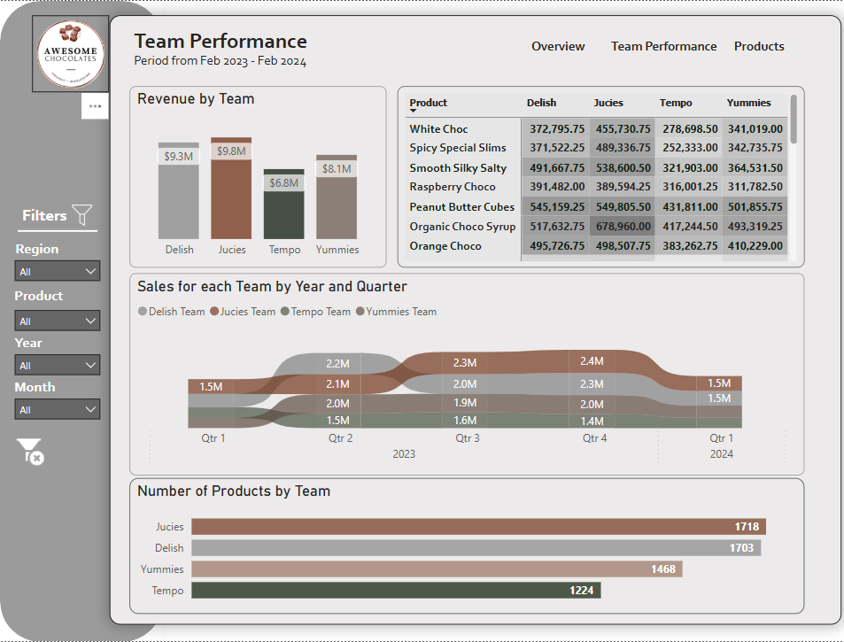

# Day_4

# 📈 Business Performance Dashboard & Report

A compact analytics project showcasing business performance from **Feb 2023 to Feb 2024**, built with Power BI and summarized in a branded PowerPoint.

---

## 🗂 Files Included

- `day4_pt.pptx` – Stakeholder-ready visual summary  
- `Business_Performance_Dashboard.pbix` – Power BI dashboard (interactive)  
- `dashboard_panel_1.png` – Financial Overview  
- `dashboard_panel_2.png` – Team Performance  
- `dashboard_panel_3.png` – Products & Regions  

---

## 📊 Dashboard Preview

### 🔹 Panel 1: Financial Overview

### 🔸 Panel 2: Team Performance

### 🟢 Panel 3: Products & Regions

---

## 🔍 Key Metrics

- 💰 **Revenue:** $34.04M  
- 📦 **Profit Margin:** 60.29%  
- 🥇 **Top Product:** Organic Choco Syrup  
- 🧑‍💼 **Best Team:** Juicies  
- 🚀 **Best Sales Rep:** Kelci Walkden  

---

## 🚀 How to Use

- 📥 Download the `.pptx` for a quick executive summary  
- 📊 Open `.pbix` in Power BI Desktop for full interactivity  
- 🖼 Use screenshots for reference or documentation

---

## 📬 Contact

For feedback or collaboration, open an issue or connect via GitHub.
